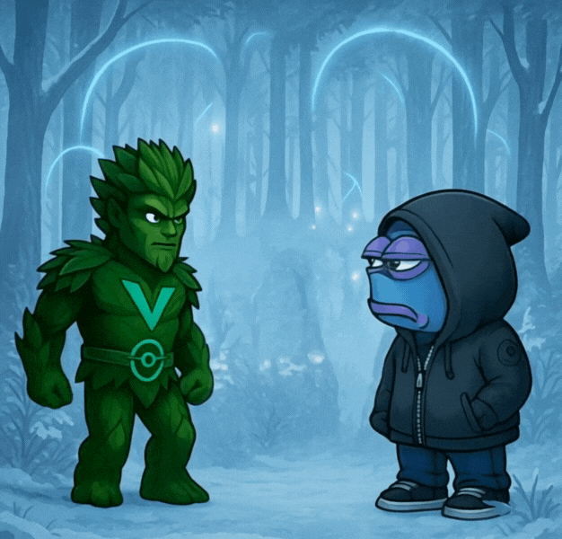

# Arcadium

***

### Gameplay

<figure><figcaption></figcaption></figure>

_**Arcadium**_ comprises of a game world - the longer-term plan for _**Verdant**_ - a casino and various mini-games. The currency for the game world, and casino, is _**Bloom ($BLM)**_.

_**Arcadium**_ will feature both singleplayer and multiplayer games, player-vs-player and player-vs-enemy.&#x20;

***

### Key Features

* _**Verdant World**_ - Explore the vast expanse of _**Verdant**_. Interact with your miners, embark on adventures and discover hidden rewards.&#x20;
* **Play-to-Burn**: Tokens collected inhouse by the house edge are burned! Creating deflationary pressure and a sink for _**$VDNT**_.
* **Gamified Yield**: Instead of just passively earning, users can multiply or lose rewards through skill or luck.
* **Cosmetics & Utility Items**: Unlock special skins, power-ups, or vanity assets by participating in _**Arcadium**_ events.

***

### Sample Games

<table><thead><tr><th>Game</th><th>Mechanics</th><th width="260">Burn Model</th></tr></thead><tbody><tr><td><strong>Crash</strong></td><td>Ride the multiplier rocket, cash out before it crashes</td><td>Burn % of losing bets</td></tr><tr><td><strong>Flip</strong></td><td>High-speed coinflip duels with 2–4 players</td><td>Winner takes pot, house burns cut</td></tr><tr><td><strong>Landmine</strong></td><td>Pick safe tiles to increase multiplier. Hit a landmine and lose all. Cash out anytime.</td><td>Burn tokens on lost plays.</td></tr><tr><td><strong>Roulette</strong></td><td>Classic 8-bit wheel-of-doom RNG</td><td>Every spin has a % to burn</td></tr><tr><td><strong>Rock, Paper, Scissors</strong></td><td>PvP rock paper scissors. Trust me, it gets heated!</td><td>Winner takes pot, house burns cut</td></tr></tbody></table>

> 👾 New games roll out seasonally, each with its own leaderboard, prize pool, and meta.

***

### Seasonal Events & Leaderboards

Each season, _**Arcadium**_ features unique events:

* Weekly & monthly leaderboards
* Miner rewards and exclusive loot
* Cosmetic rewards & achievement NFTs
* Developer-hosted tournaments

***

### Why the Arcadium Matters

_**Arcadium**_ is more than just fun. It’s part of Verdants core sustainability loop:

* Recycles passive rewards into active gameplay
* Burns tokens on every play, lowering inflation
* Adds utility for whales and casuals alike
* Encourages **stickiness** by making Verdant fun to engage with daily

> “In Verdant, yield isn’t just grown — it’s played.”
