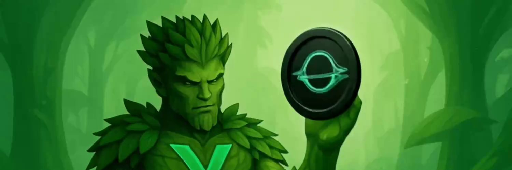

# Verdant World

<figure><figcaption>
Verdant world is powered by $VDNT - The native currency of Project Verdant
</figcaption></figure>

***

Verdant World is the foundation of the Project Verdant ecosystem — a competitive, yield-generating environment where players manage miners, deploy strategies, and engage in PvP attacks. It blends DeFi mechanics with interactive gameplay, rewarding those who can adapt and thrive.

In this section, we'll break Verdant World down into four core parts:\
**Tokens**, **Miners**, **Items**, and **Rules** — each essential to mastering the ecosystem.

***

## The Miners

There are three different miner levels in Verdant:

* _**Basic**_
* _**Advanced**_
* _**Elite**_

Each miner offers different rewards generation and scaling potential.&#x20;

Rewards are paid out continuously in _**Verdite ($VDT)**_ - not to be confused with _**Verdant ($VDNT)**_, the core ecosystem token. _**Verdite**_ can be refined into _**Verdant**_.

***
