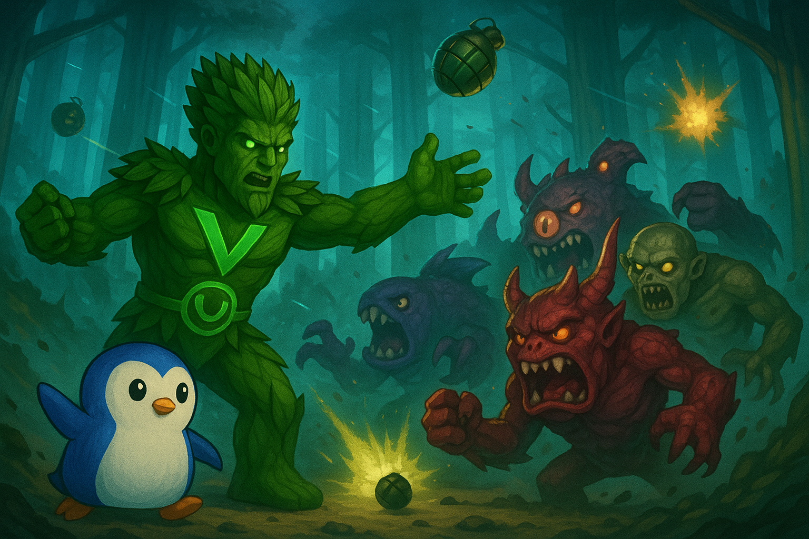

# Items

Items introduce a dynamic layer of PvP strategy, allowing players to influence each other's yield&#x20;

Items are categorized by rarity, which determines which miners they can affect:

<figure><figcaption></figcaption></figure>

* **Promotional (Starter)** — Exclusive to Starter miners (airdrop only).
* **Common (Basic)** — Works only on Basic miners.
* **Rare (Advanced)** — Works only on Advanced miners.
* **Mythic (Elite)** — Works only on Elite miners.

#### Item Types

* **Minor Bomb**
  * **Cost:** 1% of Miner Cost
  * **Effect:** Destroys **1 shield** on a miner.
  * **Inventory Limit:** 99 units
* **Major Bomb**
  * **Cost:** 2% of Miner Cost
  * **Effect:** Destroys **2 shields** on a miner.
  * **Inventory Limit:** 99 units
* **Minor Shield**
  * **Cost:** 10% of daily yield × E-ROI
  * **Effect:** Adds **1 shield** to a miner.
  * **Inventory Limit:** 99 units
* **Major Shield**
  * **Cost:** 20% of daily yield × E-ROI
  * **Effect:** Adds **2 shields** to a miner.
  * **Inventory Limit:** 99 units
* **Restore**
  * **Cost:** 40% of Miner Cost
  * **Effect:** Adds **1 life** back to an active miner.
  * **Inventory Limit:** 99 units
* **Revive**
  * **Cost:** 15% of Miner Cost × E-ROI
  * **Effect:** Revives **disabled** miners back into active status.
  * **Inventory Limit:** 99 units
* **Morph**
  * **Cost:** Not purchasable
  * **Effect:** Upgrades a miner to the **next rarity tier**.
  * **Inventory Limit:** 1 unit
* **Expansion**
  * **Cost:** 5% of Miner Cost
  * **Effect:** Adds **+1 miner slot**, increasing your miner capacity.
  * **Inventory Limit:** 99 units

***

#### Strategic Insights

* **Bombs** lower a rival miner’s defences, eventually disabling them and halting their yield production.
* **Shields** strengthen your defences against incoming attacks.
* **Restore and Revive** items are essential for long-term miner survival after PvP or maintenance failures.
* **Morph** allows you to scale a miner into a more powerful, rarer class — a major advantage.
* **Expansion** increases your fleet size, boosting your overall yield potential.

***

Verdant’s item system turns simple yield farming into a **competitive, tactical game** — where smart use of offense, defence, and recovery items defines the top players.
