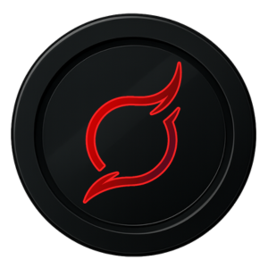
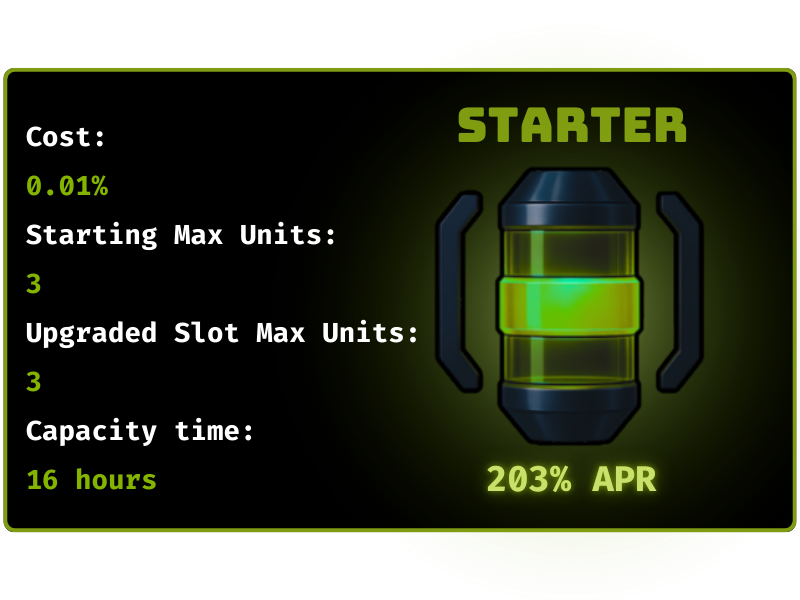
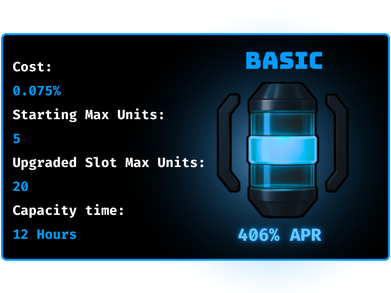
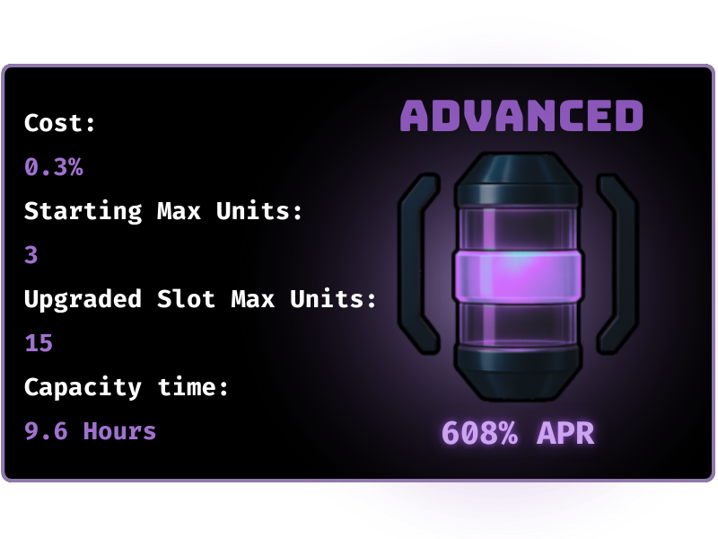
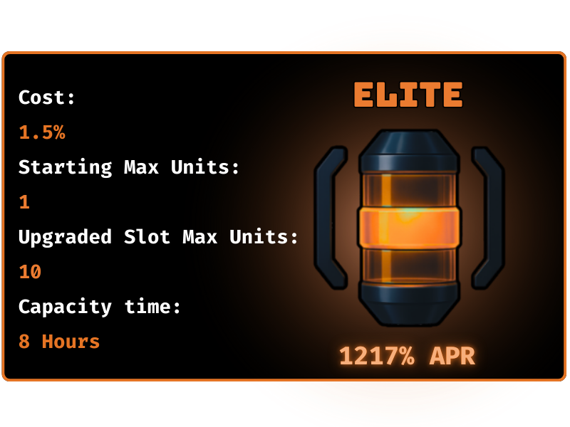
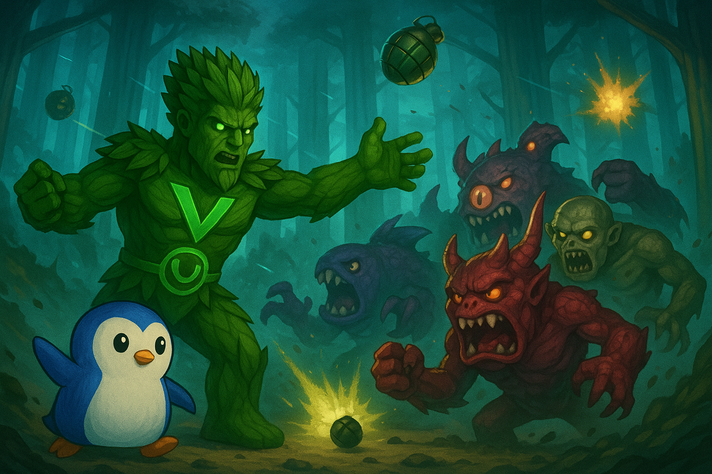

# Verdant World

<figure><figcaption></figcaption></figure>

Verdant World is the foundation of the Project Verdant ecosystem — a competitive, yield-generating environment where players manage miners, deploy strategies, and engage in PvP attacks. It blends DeFi mechanics with interactive gameplay, rewarding those who can adapt and thrive.

### Verdant World breaks down into four core parts: **Tokens**, **Miners**, **Items**, and **Rules**

***




The Verdant ecosystem uses a structured three-token system designed to support a sustainable, net-deflationary economy:

## The three currencies of Verdant World

<figure><figcaption>
<strong>VERDANT</strong>
</figcaption></figure> <figure><figcaption>
<strong>BLOOM</strong>
</figcaption></figure> <figure><figcaption>
<strong>VERDITE</strong>
</figcaption></figure>

* **$VDNT (Verdant) - 0x6e7038eb0F16c75785c43b69A0803C0eA59739DB:**\
  The native, tradable token of the ecosystem. Players acquire $VDNT through exchanges like Reservoir Swap. It serves as the primary entry point into Project Verdant. <mark style="color:red;">**THE ONLY TRADEABLE TOKEN ON PROJECT VERDANT.**</mark>\
  \
  &#xNAN;**$VDNT  has a maximum supply of&#x20;**<mark style="color:yellow;">**21,000,000**</mark>\

* **$BLM (Bloom):**\
  The in-world utility token and primary currency for Verdant World and Arcadium activities. Players **convert $VDNT into $BLM** at a fixed rate of **1 $VDNT = 1,000 $BLM**. Bloom is used to purchase miners, pay maintenance fees, buy items, and participate in games.\

* **$VDT (Verdite):**\
  The rewards token generated daily by miners. **$VDT must be refined back into $VDNT** to be tradable. The conversion rate is **5,000 $VDT = 1 $VDNT**.

### Token Conversion Summary:

* **$VDNT -> $BLM:** 1 $VDNT = 1,000 $BLM
* **$VDT -> $VDNT**: 5,000 $VDT = 1 $VDNT

**All conversions are subject to a 10% tax**, to fuel the ecosystem.

### Economic Flywheel

The core Verdant loop works like this:

1. **Buy $VDNT** - entry point into the ecosystem
2. **Convert $VDNT → BLM**&#x20;
3. **Use BLM to buy miners**
4. **Miners generate $VDT daily**
5. **Claim $VDT → Refine into $VDNT**&#x20;
6. **Convert $VDNT → BLM** again to maintain or expand your miner fleet&#x20;
7. **Optionally, spend $BLM in the Arcadium** — Verdant’s retro-style game hub



Miners are the core yield-generating assets within Verdant World. Players deploy miners to earn daily rewards, maintain their operations, and defend their holdings against PvP attacks. Each miner type has unique characteristics that impact strategy and potential returns.

<figure><figcaption></figcaption></figure>

## The four types of Miners

<figure><figcaption></figcaption></figure> <figure><figcaption></figcaption></figure>

<figure><figcaption></figcaption></figure> <figure><figcaption></figcaption></figure>

### Miner Pricing

Miners are purchased using **$BLM**. Pricing is based on a **fixed percentage of the $VDNT liquidity pool**, meaning miner prices scale with $VDNT's price growth — but not exponentially — keeping access fair for all players.

<mark style="color:yellow;">**Example:**</mark>\
If the liquidity pool contains 100,000 $VDNT, an Elite Miner (1.5%) costs **1,500 $VDNT**.\
Since miners are bought with $BLM, the player pays **1,500 × 1,000 = 1,500,000 $BLM**.

### Capacity and Yield

Each miner accumulates rewards over time up to its capacity limit.\
Players must **claim rewards** once capacity is full to resume earning; otherwise, rewards stop accumulating until claimed.

### Maintenance

Miners must be maintained weekly.

<figure><figcaption>
Miner Health - Seen indicated through hearts
</figcaption></figure>

Each miner has only 2 _**Health Bars**_. A _**Health Bar**_ is lost when you fail to make your weekly maintenance payment. Once a miner has lost 2 _**Health Bars**_, it will _**self-destruct**_. You will then have to purchase a brand new one.

* 🔧 **1 Missed Repair** = 1 Health Bar Lost
* 💀 **2 Missed Repairs** = Goodbye Miner
* 🪙 &#x57;_**eekly maintenance cost = 10% of Weekly ROI**_

Weekly maintenance is paid in _**Bloom ($BLM)**_. Bloom can only be obtained through _**Arcadium**_ or by exchanging _**Verdant ($VDNT)**_.

### PvP Mechanics: Bombs and Shields

Miners are vulnerable to attacks from other players:

* **Each miner starts with 2 shields and 2 lives.**
* When bombed, a miner **loses one shield** per hit.
* At **zero shields**, the miner becomes **DISABLED** and stops generating yield.
* Players must use a **revive item** to reactivate a disabled miner.
* While disabled, the maintenance countdown continues — failure to maintain can still destroy a miner.

Strategic use of shields, maintenance, and timing attacks against opponents is critical to survival and maximizing rewards.




<figure><figcaption></figcaption></figure>

Items introduce a dynamic layer of PvP strategy, allowing players to influence each other's yield&#x20;

Items are categorized by rarity, which determines which miners they can affect:

* **Promotional (Starter)** — Exclusive to Starter miners (airdrop only).
* **Common (Basic)** — Works only on Basic miners.
* **Rare (Advanced)** — Works only on Advanced miners.
* **Mythic (Elite)** — Works only on Elite miners.

#### Item Types

* **Minor Bomb**
  * **Cost:** 1% of Miner Cost
  * **Effect:** Destroys **1 shield** on a miner.
  * **Inventory Limit:** 99 units
* **Major Bomb**
  * **Cost:** 2% of Miner Cost
  * **Effect:** Destroys **2 shields** on a miner.
  * **Inventory Limit:** 99 units
* **Minor Shield**
  * **Cost:** 10% of daily yield × E-ROI
  * **Effect:** Adds **1 shield** to a miner.
  * **Inventory Limit:** 99 units
* **Major Shield**
  * **Cost:** 20% of daily yield × E-ROI
  * **Effect:** Adds **2 shields** to a miner.
  * **Inventory Limit:** 99 units
* **Restore**
  * **Cost:** 40% of Miner Cost
  * **Effect:** Adds **1 life** back to an active miner.
  * **Inventory Limit:** 99 units
* **Revive**
  * **Cost:** 15% of Miner Cost × E-ROI
  * **Effect:** Revives **disabled** miners back into active status.
  * **Inventory Limit:** 99 units
* **Morph**
  * **Cost:** Not purchasable
  * **Effect:** Upgrades a miner to the **next rarity tier**.
  * **Inventory Limit:** 1 unit
* **Expansion**
  * **Cost:** 5% of Miner Cost
  * **Effect:** Adds **+1 miner slot**, increasing your miner capacity.
  * **Inventory Limit:** 99 units

***

#### Strategic Insights

* **Bombs** lower a rival miner’s defences, eventually disabling them and halting their yield production.
* **Shields** strengthen your defences against incoming attacks.
* **Restore and Revive** items are essential for long-term miner survival after PvP or maintenance failures.
* **Morph** allows you to scale a miner into a more powerful, rarer class — a major advantage.
* **Expansion** increases your fleet size, boosting your overall yield potential.

***

Verdant’s item system turns simple yield farming into a **competitive, tactical game** — where smart use of offense, defence, and recovery items defines the top players.




### Rules of the Game (PvP Rules)

<figure><figcaption></figcaption></figure>

<mark style="color:yellow;">**To maintain fairness and strategic depth, Verdant World enforces the following PvP rules:**</mark>

1. **Grace Period:**\
   After a miner is bombed but survives (still has shields > 0), it becomes **immune to further attacks for 24 hours**.
2. **No Attacks During Grace:**\
   You **cannot attack** a miner that is under its 24-hour grace period.
3. **Item Rarity Matching:**\
   Item rarities **must match** the miner’s rarity. Only bombs and items of the same tier can affect a miner.\
   &#xNAN;_(Exception: Morph items upgrade a miner and match the upgraded rarity.)_
4. **Life Loss Mechanism:**\
   A miner's **life is lost only** when **maintenance is missed**, **not** when it is bombed.
5. **Unclaimed Rewards on Destruction:**\
   If a miner is **destroyed** (loses all lives), **all unclaimed rewards are lost permanently**.
6. **Shield Limit:**\
   The maximum number of shields a miner can have is **4 shields**.
7. **Incorrect Item Use Penalty:**\
   Incorrect use of bombs (e.g., wrong rarity, attacking during grace period, or targeting a disabled miner) will **still consume** the bomb, even though no effect is applied.








