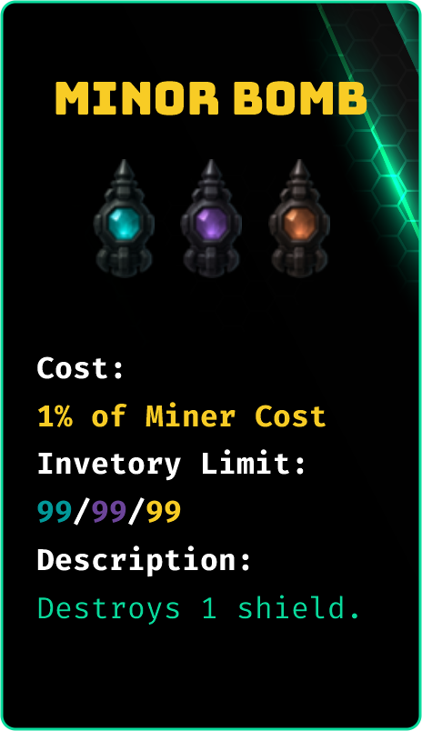
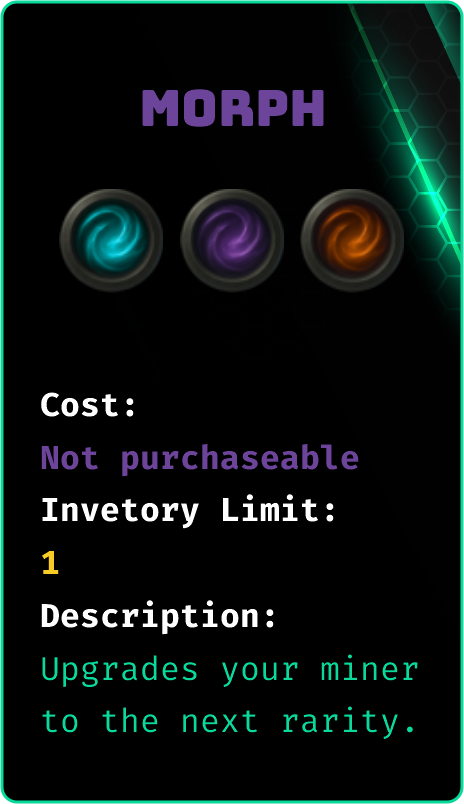

# Items

<figure><figcaption></figcaption></figure>

Items introduce a dynamic layer of PvP strategy, allowing players to influence each other's yield&#x20;

Items are categorized by rarity, which determines which miners they can affect:

* **Promotional (Starter)** — Exclusive to Starter miners (airdrop only).
* **Common (Basic)** — Works only on Basic miners.
* **Rare (Advanced)** — Works only on Advanced miners.
* **Mythic (Elite)** — Works only on Elite miners.

<figure><figcaption></figcaption></figure> <figure><figcaption></figcaption></figure> <figure><figcaption></figcaption></figure> <figure><figcaption></figcaption></figure>

<figure><figcaption></figcaption></figure> <figure><figcaption></figcaption></figure> <figure><figcaption></figcaption></figure> <figure><figcaption></figcaption></figure>

***

#### Strategic Insights

* **Bombs** lower a rival miner’s defences, eventually disabling them and halting their yield production.
* **Shields** strengthen your defences against incoming attacks.
* **Restore and Revive** items are essential for long-term miner survival after PvP or maintenance failures.
* **Morph** allows you to scale a miner into a more powerful, rarer class — a major advantage.
* **Expansion** increases your fleet size, boosting your overall yield potential.

***

Verdant’s item system turns simple yield farming into a **competitive, tactical game** — where smart use of offense, defence, and recovery items defines the top players.
