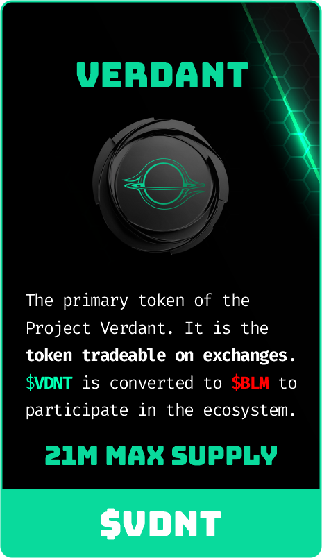
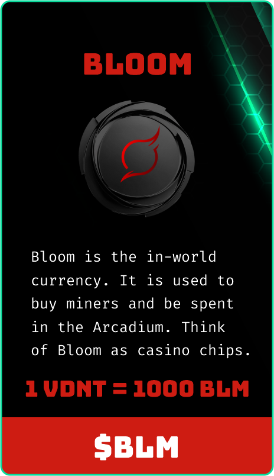
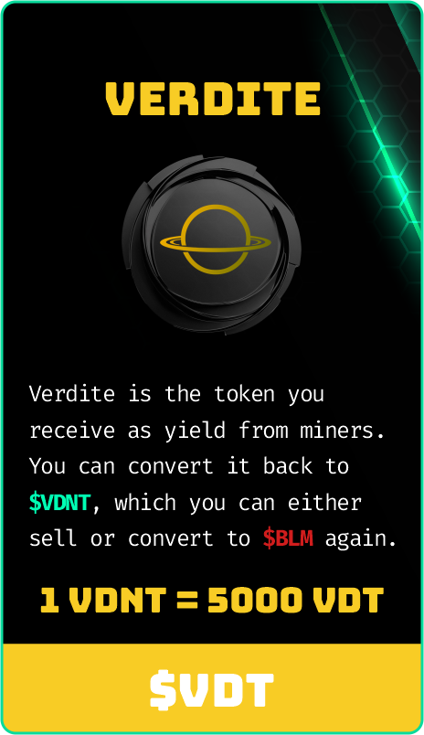

# Tokens & Conversions

The Verdant ecosystem uses a structured three-token system designed to support a sustainable, net-deflationary economy:

## The three currencies of Verdant World

<figure><figcaption></figcaption></figure> <figure><figcaption></figcaption></figure> <figure><figcaption></figcaption></figure>

**The Verdant contract address is -** 0x6e7038eb0F16c75785c43b69A0803C0eA59739DB:\
It serves as the primary entry point into Project Verdant. <mark style="color:red;">**THE ONLY TRADEABLE TOKEN ON PROJECT VERDANT.**</mark> Bloom is used to purchase miners, pay maintenance fees, buy items, and participate in games and Verdite is the rewards token generated daily by miners.\

### Economic Flywheel

The core Verdant loop works like this:

1. **Buy $VDNT** - entry point into the ecosystem
2. **Convert $VDNT → BLM**&#x20;
3. **Use BLM to buy miners**
4. **Miners generate $VDT daily**
5. **Claim $VDT → Refine into $VDNT**&#x20;
6. **Convert $VDNT → BLM** again to maintain or expand your miner fleet&#x20;
7. **Optionally, spend $BLM in the Arcadium** — Verdant’s retro-style game hub
